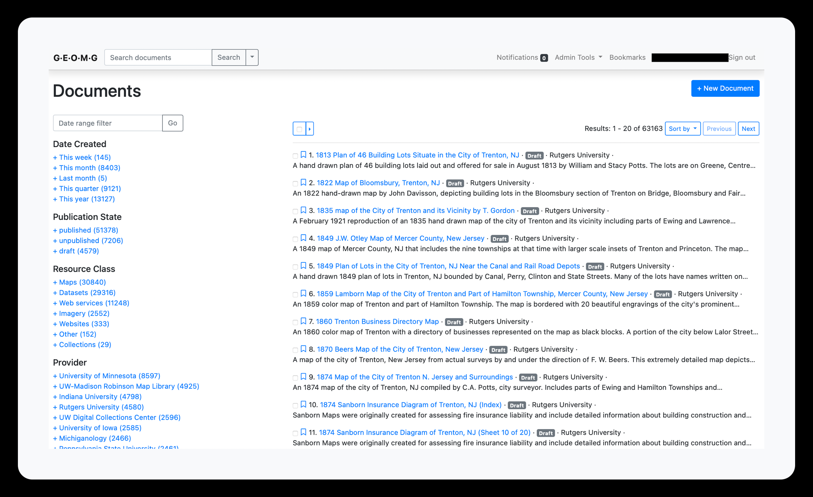
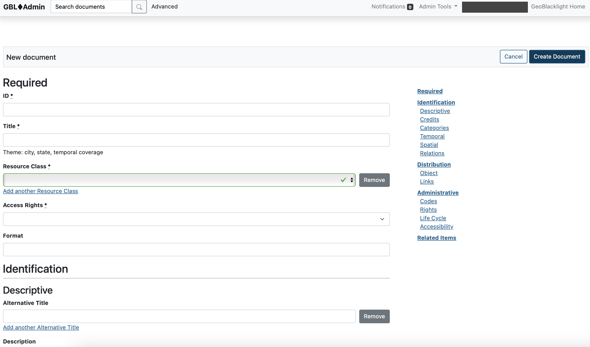
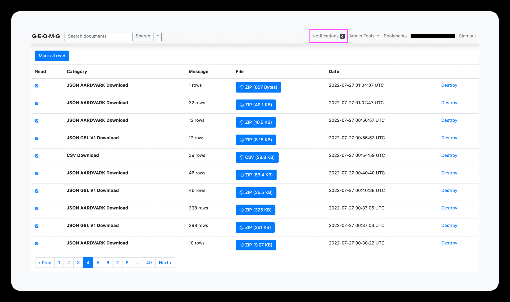
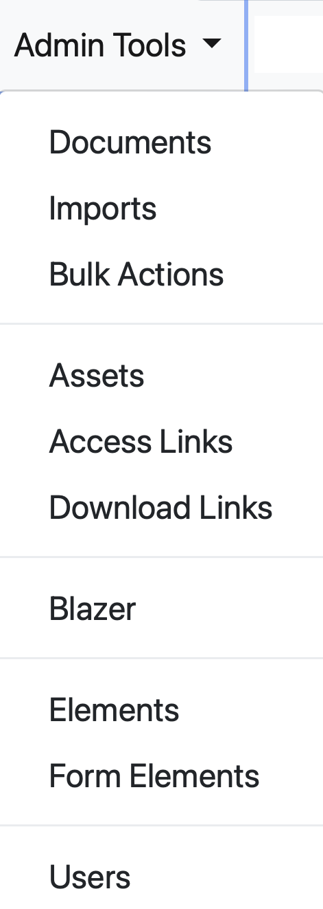

## Dashboard (Home page)

The Dashboard shows a list of all records in the index. These can be selected or filtered. The search functionality mimics the GeoBlacklight interface:

* a search bar at the top for text searches
* a list of facets on the left to filter records
* a Date Range filter above the facets to select items by Date Created (when they were first added).

----------
## Form view

This page is where new records can be manually created and existing records can be edited.

!!! tip

	Click on the button "View in Geoportal" to open a new tab with the record in the Geoportal. Note: the record is still viewable in the Geoportal via this button, even if it is a Draft or Unpublished.

------------
### Notifications

Notifications is where the exported files can be found.

------------
## Admin Tools

The Admin Tools is a dropdown menu item that contains links to the various actions.

