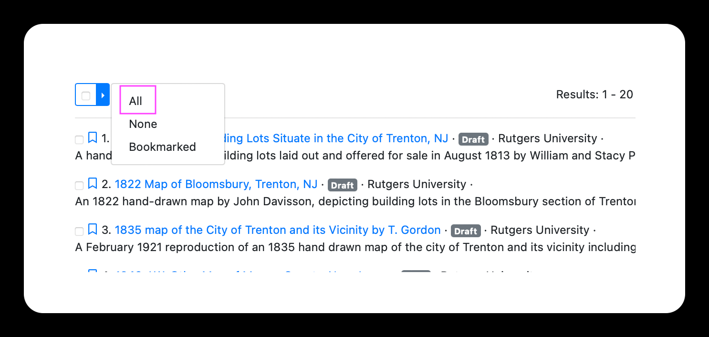
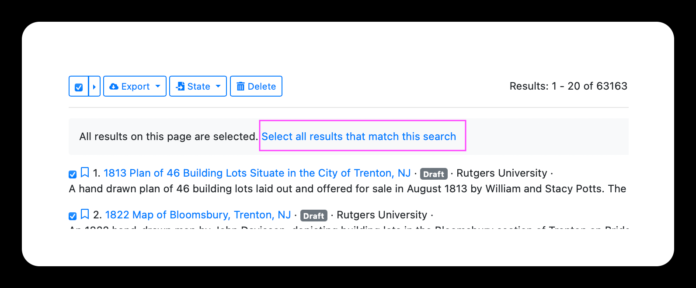

# Select records

## How to select all records on a single page

Use the check boxes to select individual records or click the right arrow to select all records on the page.

## How to select all records in search results

To select all records in the list, first select all records on the page. Then, click the text, "Select all results that match this search."

