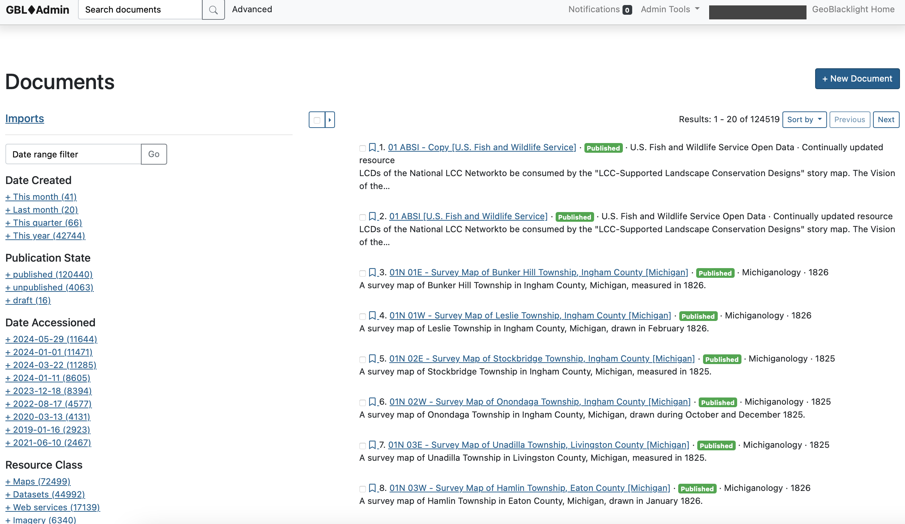

# Views

There are two main document views: Documents and Form View.

## Documents

The Documents shows a list of all records in the index. These can be selected or filtered. The search functionality mimics the GeoBlacklight interface with a list of facets on the left to filter records. 

It also features:

* Date Range filter: to select items by Date Created (when they were first added).
* Imports: Shortcut to filter to specific CSV metadata imports.

----------
## Form view

This page provides all of the editable fields for an individual record. Users can create new records or edit existing records manually with the Form view.

to access the Form view, click on a record in the Documents list or click the button "New Document".

!!! tip

	Click on the button "View Geoportal" to open a new tab with the record live in GeoBlacklight. Note: the record is still viewable live via this button, even if it is a Draft or Unpublished.

------------

